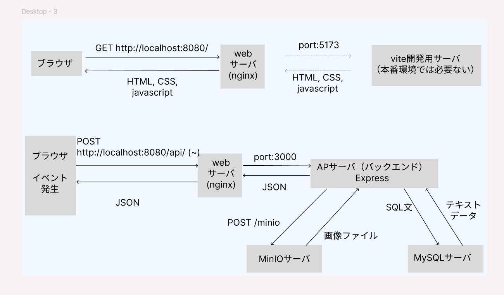
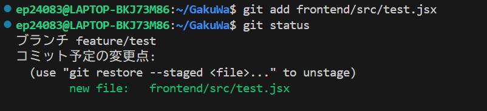
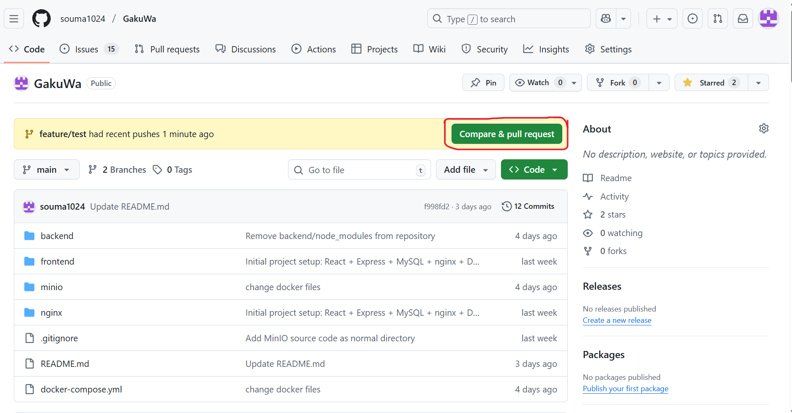
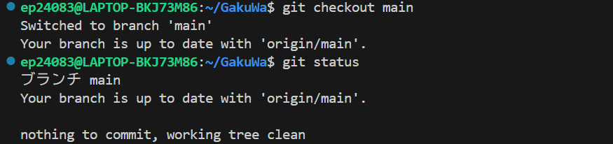
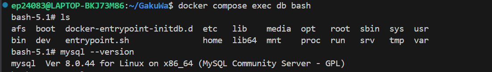
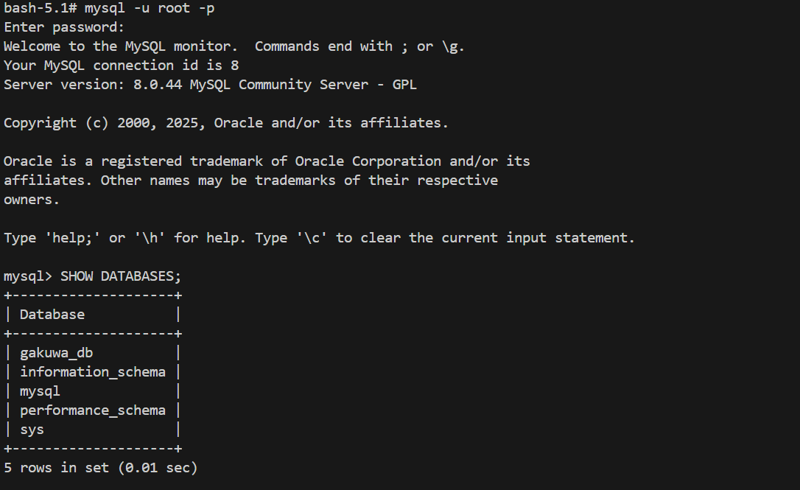
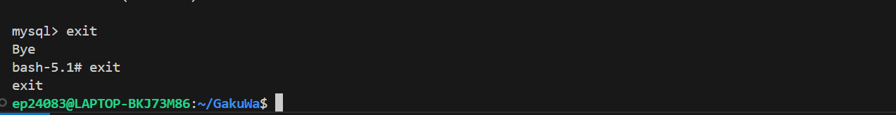

# GakuWa
### ~ 学生の「輪（コミュニティ）」や「話（情報共有）」 ~
## 開発背景
学生がアプリ開発をしたり技術力を高めたい場合、一人でやるにはモチベーションが上がらないし、チームでやるにはハードルが高いといった問題がある。そこで、学生が気軽にコミュニティに参加しチームでアプリを作成。そして、そこで得た知見などを情報共有できるプラットフォームが欲しいと思った。

<br>

## 🛠️ 使用技術
### フロントエンド
- React

### バックエンド
- Express.js (Node.js)

### データベース
- MySQL

### インフラ
- Docker / Docker Compose
- nginx
- MinIO (S3 Compatible Object Storage)
- MailHog (Mail Testing Tool)

### その他
- Git / GitHub

<br>

## システム構成

<br>

<details><summary>システム構成画像</summary>
 

</details>


<br>

## セットアップ手順

### 1　Gitのセットアップ
ubuntu上で以下のコマンドを実行してください
```
 $ sudo apt update
 $ sudo apt install git
```
バージョンを確認( 実行して　git version 2.43.0 のように出てきたら成功)
```
 $ git --version
```
Gitにアカウントを設定します
```
$ git config --global user.name "<ユーザ名>"
$ git config --global user.email "<メールアドレス>"
```

### 2　Docker Desktop(windows用)のインストール
手順１　Docker Desktop for Windows をダウンロード <br>
https://www.docker.com/ja-jp/products/docker-desktop/

手順２　インストール時にチェックすべき項目（超重要）
インストーラー途中で次の項目を 必ず ON にする：
 -  ☑ Use WSL 2 instead of Hyper-V
 -  ☑ Add shortcut to desktop
 -  ☑ Install required components for WSL 2（出る場合）


手順３　WSL（Ubuntu）から Docker を使えるか確認
```
 ~$ docker --version
 ~$ docker compose version
```
両方のバージョンが出たら成功

[参考サイト](https://zenn.dev/upgradetech/articles/8e8b82e9d5c494)
### 3　ローカルPC上でサーバーを立てる
  手順１　ubuntu上で以下のコマンドを実行し、GithubのレポジトリをローカルPCにクローンする
  ```
   ~$ git clone https://github.com/souma1024/GakuWa.git
  ```
  
  手順２　Dockerデスクトップを起動する
  
  手順３　以下のコマンドをしdockerコンテナを立てる（ローカルPC上にサーバーが立ち上がる）
  ```
   ~/ cd GakuWa
   ~/GakuWa$ docker compose up --build
  ```
  
  各サーバーへのアクセスは以下から <br>
  http://localhost:8080/ ：webサーバ（フロントエンド）　<br>
  http://localhost:3000/ ：webサーバ（バックエンド）　<br>
  http://localhost:8025/ ：MailHogサーバ　<br>
  http://localhost:9001/ ：MinIOサーバ　<br>

<br>

## 開発の進め方
<details><summary>開発の進め方</summary>
 
### 手順１　ローカルレポジトリの現在のブランチがmainブランチかどうか確認する
```
  git status
```
<details><summary>実行例</summary>
 


</details>

<br>

### 手順２　mainブランチならリモートリポジトリの変更をローカルリポジトリに取り込む
```
  git pull --rebase origin main
```

<details><summary>例:リモートリポジトリに変更があった場合</summary>

--rebaseがあったほうが望ましい


</details>

<details><summary>例:リモートリポジトリに変更がなかった場合</summary>
 
 --rebaseがあったほうが望ましい <br>
下の画像の状態になったら、リモートリポジトリとローカルリポジトリが同じ状態なので手順３へ

</details>

<br>

### 手順３　ローカルブランチに新しいブランチを作成し移動する
```
  git switch -c (branch名)
```

<details><summary>例:ブランチ名はfeature/test にした </summary>
 


</details>

<br>

### 手順４　Issueに従いコーディングを行う(ファイルを変更したら、以下の画像のような状態になる)

<details><summary>例: ファイルを変更後</summary>
 


</details>

<br>

### 手順５　ファイルを変更したらそのファイルを追跡対象に追加する
```
  git add (ファイル名、ディレクトリ名、 . )
```

<details><summary>実行例</summary>



</details>

<br>

### 手順６　追跡対象にしたファイルの変更を確定させる
```
  git commit -m "（説明文を書く）"
```

<details><summary>実行例</summary>


</details>

<br>

### 手順７　ローカルリポジトリ上の変更したすべてのファイルに対してコミットしたら、リモートリポジトリへアップロード
```
  git push -u origin (現在のブランチ名)
```

<details><summary>実行例</summary>


</details>

<br>

### 手順８　github上にpull request作成要求が表示されるので、ボタンを押す



<br>

### 手順９　タイトル、説明文、レビューする人、作成者を選択し pull requestを作成する　


<br>

### 手順１０　レビューを待つ

<br>

### 手順１１　無事にマージされ、ローカルレポジトリの変更がリモートリポジトリに反映したら、ローカルリポジトリのブランチをmainブランチに移動
```
  git checkout main
```



<br>

### 手順１２　新しいタスクを開始する

<br>

</details>

<details><summary>開発中によく使うコマンド集 gitコマンド編</summary>
 
<br>
 
現在のブランチの状態確認
```
 git status
```
  
<br>
 
 ローカルリポジトリに存在するすべてのブランチの確認
 ```
  git branch
 ```
 
<br>
 
ローカルリポジトリに新しいブランチを作り移動する
```
 git switch -c (ブランチ名)
```
 
<br>
 
ローカルリポジトリにあるブランチに移動する
```
 git checkout (ローカルリポジトリ上にあるブランチ名)
```
 
<br>
 
ファイルやディレクトリを追跡対象にする
```
 git add (ファイル名やディレクトリ名)

 git add .    //こうすると、自分がいるディレクトリ配下の変更されたすべてのファイルが追跡対象になる
```
 
<br>
 
追跡対象のファイルの変更を確定させる
```
 git commit -m "(コメントを書く)"

 git commit   // -mを忘れると、gitに登録されているデフォルトのエディタ（おそらく vim）が起動しコメントを受け付ける
```
 
<br>
 
ローカルリポジトリの現在のブランチをリモートリポジトリにアップロードする
```
 git push -u origin (現在のブランチ名)
```
 
<br>
 
リモートリポジトリのブランチをローカルリポジトリに取り込む(どうやら git pull よりも git pull --rebaseのほうが推奨されているらしい)
```
 git pull --rebase origin (リモートリポジトリに存在するブランチ名)
```
  
<br>
 
</details>

<details><summary>開発中によく使うコマンド集 dockerコマンド編</summary>

#### docker-compose.ymlファイルに基づいて、dockerコンテナを起動する コマンド
```
 docker compose up      // 終了時は Ctrl + C
 docker compose up -d 　// -dを使うとバックグランドで起動させる
```

#### バックグラウンドで起動中のdockerコンテナを停止するコマンド
```
 docker compose down
```

#### docker-compose.ymlやdockerファイルが変更された場合にのみ使用する、コンテナを再構築するコマンド
```
 docker compose up --build
```

#### frontendやbackendのpackage.jsonファイルにパッケージを追加するコマンド
```
  docker compose run --rm (frontend もしくは backend) npm install (パッケージ名)
```


#### dockerコンテナの中に入るコマンド
```
 docker compose exec (SERVICE_NAME) bash
```

<details><summary>DBコンテナに入り、MySQLにアクセスする例</summary>

 コンテナに入るコマンド
 ```
  docker compose exec db bash
 ```
 

 mysqlにrootユーザーでログインするコマンド (passwordはdocker-compose.ymlファイルを参照)
 ```
  mysql -u root -p
 ```
 

 mysqlのログアウト及びコンテナから出る (exit)
 
 
</details>


#### 

</details>

<br>

## 参考のサイト
